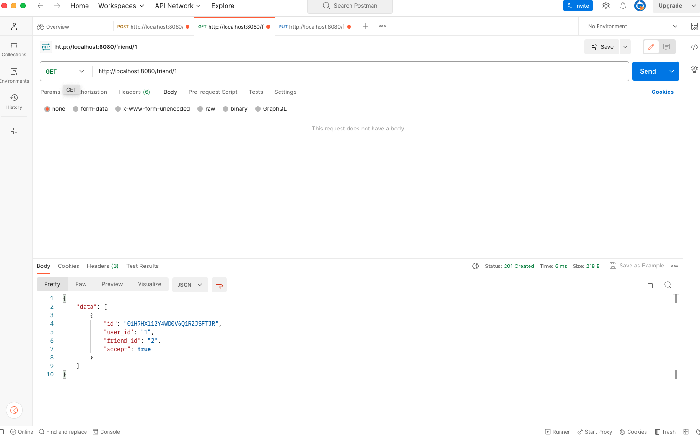

# server

## 環境構築

Go-1.18 over
docker desktop app を立ち上げておく
API動作の確認は**postman**を使用する
ダウンロードは[こちら](https://www.postman.com/)から

`/server`
仮想環境を立ち上げる

```zsh
#初回
make up

#それ以降
make re
```

## ディレクトリ構造

このままか変えるかは検討中
現状を記しておく

```none
/server
├ cmd
|  └ root.go　 // ルーティングの集約をしてサーバーと接続
├ database
├ docker
├ internal
|  ├ config
|  |  └ port.go　 //port番号を定義している
|  ├ domain
|  |  ├ entity    // データの型定義をしている
|  |  └ repository　 //apiを定義している
|  ├ infrastructure
|  |  ├ config    // データベースの環境変数を設定している
|  |  ├ database    // データベースの接続
|  |  └ repository　//　APIのデータベース上の命令をしている
|  |    └ dto  // データベースとAPIの型を一致させる
|  └ usecase　 // APIの入出力の型定義
|
├ util　// 色んなところで使えそうな関数を置いている
|
├ web
|  ├ http　
|  |  ├ handler   // サーバーに返すレスポンスを定義
|  |  └ json　//　jsonで返す型を定義している
|  └ router　 // ルーティングの定義
|
├ main.go
//以下略
```

## 開発時の注意

- 作業ディレクトリは必ず`/server`で
- 開発前に**pull**を必ずする
- API を書き直したら`make generate`をして`make re`で仮想環境を再起動する
- commit するディレクトリも必ず`/server`

## postmanの使い方



- **GET** : APIのやり取りを選択する（POST, GET, PUT, DELETEなど）
- **http://...** : URLを指定する
- **Body** : データの入力をjson形式でする（rawを指定、POSTとPUTするときに必要）

## APIがうまく動かない時

1. エラーに目を通す
   - なぜかがわかったら調べたり誰かに聞いたりする 

2. データベースに接続し挙動を確認する
   - 意外にデータベースを見ると解決したりすることもある
   - クエリは調べてみてください
   **データベースの入り方**
   1. Dockerのデータベースの方のTerminalに入って以下のコマンドを打つ

      ```zsh
      mysql -u hack-camp_vol4_2023-1_database -pp@ssword -h hack-camp_vol4_2023-1_database -P 3306
      ```

   2. 使用するデータベースを指定する

      ```zsh
      use hack-camp_vol4_2023-1_database;
      ```

   3. テーブルを確認する

      ```zsh
      show tables;
      ```

### パスを通す

1. go 自体入っているか確認

   ```zsh
   go version

   #error出たらこれを打つ
   brew install go
   ```

2. go のパスを確認（`GOPATH`, `GOROOT`, `GOTOOLDIR`が設定されているかを確認）

   ```zsh
   go env
   ```

3. go の PATH を設定する

   ```zsh
   vim ~/.zshrc
   ```

   ```vim
   export PATH="$HOME/go/bin:$PATH"
   ```

   ※vim の使い方は[こちら](https://qiita.com/okamos/items/c97970ab34ff55ff3167)より

4. もう一度確認して PATH が通っているかを確認する

   ```zsh
   gqlgen version
   ```
